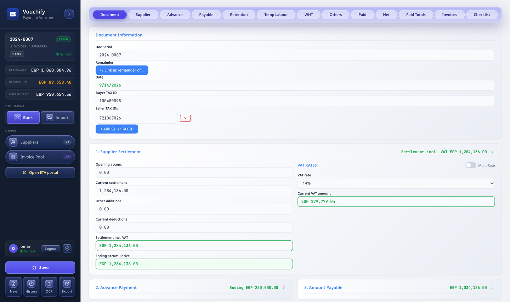
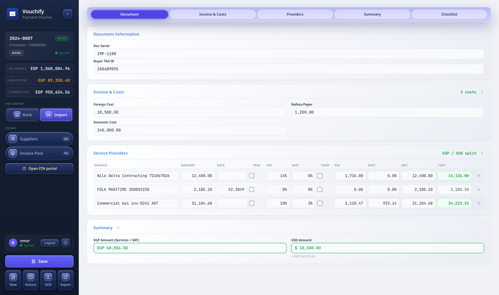
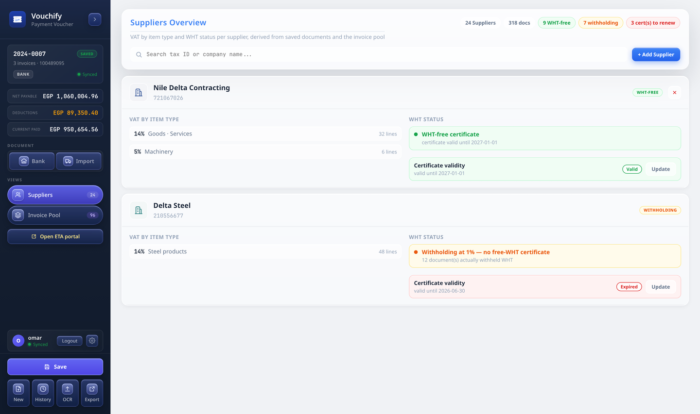
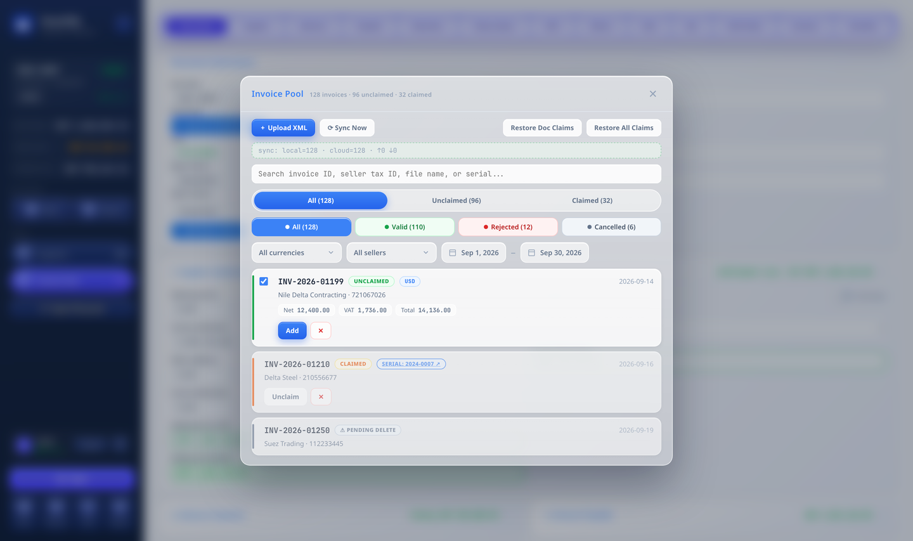
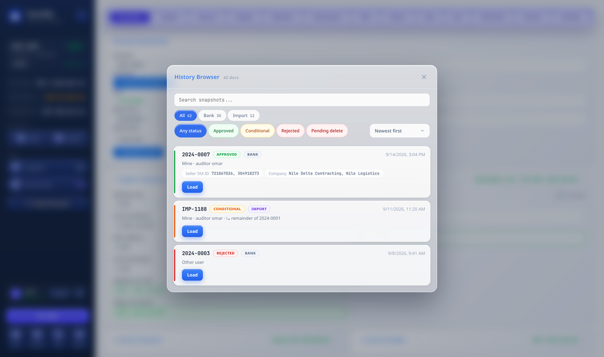

# Vouchify

**Vouchify** is a desktop payment-voucher and tax-reconciliation app for construction and import settlement work in Egypt. It turns supplier invoices, ETA e-invoices, and advance/retention data into auditable settlement vouchers, validates import documents against their XML, keeps a shared invoice pool, and synchronises everything across devices.

Built with **Tauri 2 + React + TypeScript + Rust**, with a local SQLite store and optional **Supabase** cloud sync.

> By **Omar Mahmoud**

---

## Screenshots

| Bank settlement voucher | Import (ETA) voucher |
| --- | --- |
|  |  |

| Suppliers | Invoice Pool |
| --- | --- |
|  |  |



---

## Core features

### 1. Bank settlement vouchers
A guided, numbered settlement sheet (cards 1–12) that computes the amount payable to a supplier:

- Supplier settlement (invoices incl. VAT), advance payments and ending balance.
- Amount payable, retention, temp-labour insurance.
- Withholding tax (WHT) — automatic or manual, with rates per supplier.
- Other deductions, social insurance, amount paid, net payable and paid totals.
- Automatic **manual/duplicate-payment warnings** when an invoice is already referenced by another document.

Every figure recalculates live in the Rust backend, so the form, the summary and the exports can never drift apart.

### 2. Import (ETA) vouchers
A dedicated import sheet for customs/ETA paperwork:

- Invoice & cost cards (foreign cost, domestic cost, Nafeza paper, …).
- **Service providers table** with a **VAT by item type** breakdown.
- **EGP / USD split** side panel that separates local and foreign-currency lines (A–D service codes and 9-digit tax IDs included; Nafeza/Commercial/Form 4–6 excluded), aligned to the “Grand Total (Amount + VAT) − Temp Labour” row.
- Checklist for SAD, commercial invoice, bill of lading, packing list, certificate of origin, Nafeza and Form 4/6.

### 3. Invoice Pool
A shared pool of ETA XML invoices that can be claimed by any document:

- **Batch XML import** with live progress.
- Search and filter by currency, seller, date range and document status (Valid / Rejected / Cancelled).
- Claim (attach) invoices to a document, unclaim, or validate before attaching.
- Synthetic/legacy UUIDs are normalised so the same invoice never duplicates on re-import.
- **Admin delete requests**: normal users request deletion, admins approve or reject.
- Cloud sync with local fallback.

### 4. ETA XML validation
Imports the e-invoice XML alongside a document and verifies it field-by-field:

- Per-invoice result with **errors and warnings** and the exact `XML → Form` value mismatch.
- Summary tiles (issues / errors / warnings) and a searchable result list.
- One-click **validation report export**.

### 5. Suppliers & WHT-free certificates
A supplier overview derived from saved documents and the invoice pool:

- **VAT by item type** and current **WHT status** per supplier.
- **WHT-free certificate registry** with validity dates (valid / expiring soon / expired / missing).
- Manually added suppliers (never renamed) that sync across devices.
- A supplier is only treated as WHT-free when a valid certificate exists **and** no WHT was actually withheld.

### 6. History Browser
Every save is a snapshot. The browser lets you:

- Search and filter by type (Bank / Import) and decision (Approved / Conditional / Rejected / Pending delete), with counts and sorting.
- **Load a snapshot and keep editing** — pressing Save updates that same snapshot in place.
- **Duplicate-serial protection**: you can’t save two documents under the same serial number.
- Admin delete requests and full audit info (owner, auditor, remainder-of links).

### 7. Exports
- **Settlement workbook** (Excel) with the EGP/USD layout and merged “Grand Total − Temp Labour” rows.
- Invoice registry export by date range.
- Validation report export.
- History registry export.

### 8. Accounts & sync
- Email/password sign-in (Supabase) with row-level security.
- Local-first storage (SQLite) with cloud sync and offline fallback.
- Admin role for invoice-pool and history delete approvals.

---

## Design

Vouchify uses a single **“liquid glass” design language** across every surface:

- Frosted-glass panels over a soft, blurred backdrop, with hairline borders and layered shadows.
- **Glass buttons, chips, tabs and inputs** with a cursor-tracking **specular highlight** on hover.
- Consistent **status colours** (green = approved/valid, orange = conditional, red = rejected/pending, grey = cancelled).
- **Card lists** with coloured left rails for documents, invoices and validation results.
- **Bilingual** UI — English / 中文 — toggleable from the account menu.

## Other features

- **Offline-first** with automatic cloud sync when signed in.
- **In-app updater** with signed release artifacts.
- Keyboard-friendly inputs with caret-safe number formatting.
- **Remainder documents**: link a document as the remaining part of another so deductions are only applied once.
- Automatic claim restoration if the invoice pool is wiped or a device was offline.

---

## Tech stack

| Layer | Technology |
| --- | --- |
| Shell | Tauri 2 (Rust) |
| UI | React 19 + TypeScript + Vite |
| Backend | Rust (`calc`, `excel`, `history`, `eta_xml`) |
| Local store | SQLite |
| Cloud | Supabase (Postgres + Auth + RLS) |
| Exports | `rust_xlsxwriter` |

## Getting started

```bash
# install dependencies
npm install

# run the desktop app in dev mode
npm run tauri dev

# build the production bundle
npm run tauri build
```

> Releases are published from `v*` tags via GitHub Actions. The in-app updater checks the latest release automatically.

## Credits

Designed & developed by **Omar Mahmoud**.
